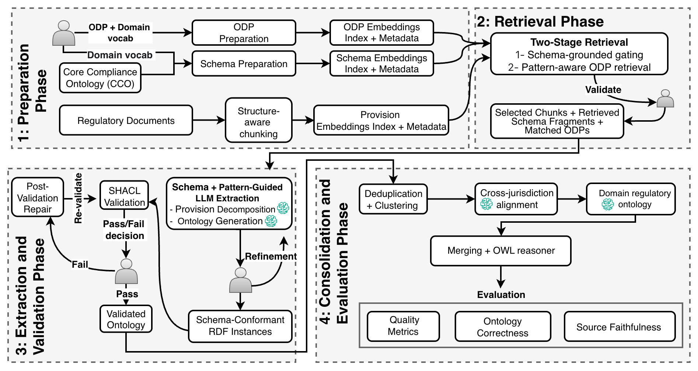

# Synthesising Regulatory Ontologies: A Schema and Pattern-Guided Approach

This repository contains the code, ontologies, prompts, and evaluation materials accompanying the paper:

**Synthesising Regulatory Ontologies: A Schema and Pattern-Guided Approach**  
Umair Arshad, David Corsar, Ikechukwu Nkisi-Orji  
*Robert Gordon University, Aberdeen, United Kingdom*  
Submitted to EKAW 2026.

---

## Overview

We present a schema- and pattern-guided approach for regulatory ontology synthesis, in which LLM extraction is constrained directly within a target ontology rather than mapped to it afterward. The method integrates the [Core Compliance Ontology (CCO)](https://github.com/RGU-Computing/CCO) with twelve extraction patterns and two consolidation patterns, combining two-stage retrieval, two-step LLM-driven extraction with SHACL validation and deterministic repair, and a consolidation phase that produces both jurisdiction-scoped and shared domain regulatory abstractions under OWL RL reasoning.

The approach is demonstrated on education funding regulations across four jurisdictions (United Kingdom, United States, Canada, Australia), producing a unified legislation regulatory ontology of 1,295 named classes layered over CCO.

<div align="center">

</div>

*Figure 1: Overview of the proposed four-phase schema- and pattern-guided pipeline for regulatory ontology synthesis, comprising preparation; retrieval, extraction and validation, and consolidation and evaluation. Blocks marked with the AI icon denote stages in which LLMs are used.*


---

## Documentation

Full ontology documentation is available at:
**[Unified Legislation Regulatory Ontology](https://rgu-computing.github.io/Synthesising-Regulatory-Ontologies/)**

**Note:** The published documentation shows the ontology schema (classes, properties, hierarchy) only. Individual instances (extracted RDF data) are available in the TTL files under `ontology/`.

---

## Repository Structure

```
.
├── ontology/                    # Synthesised regulatory ontology
│   ├── per-jurisdiction/         # Per-jurisdiction ontologies (UK, US, CA, AU)
│   ├── shared/                   # Domain regulatory ontology (69 shared classes)
│   ├── alignments/               # SKOS cross-jurisdiction mappings (362)
│   └── unified/                  # Unified legislation regulatory ontology
│
├── schema-and-patterns/             # Schema and pattern artefacts
│   ├── cco_schema.json               # CCO base schema (classes + properties whitelist)
│   ├── extraction_odps.json          # 12 extraction ODPs
│   └── consolidation_patterns.md     # Functional equivalence + shared domain superclass
│
├── prompts/                     # LLM prompts (Phase 3 + Phase 4)
│   ├── decomposition_prompt.txt
│   ├── generation_prompt.txt
│   ├── alignment_prompt.txt
│   └── shared_naming_prompt.txt
│
├── shacl-shapes/                # SHACL validation shapes
│   └── cco_shapes.ttl
│
├── evaluation/                  # Evaluation materials
│   ├── quality_metrics/          # Domain ontology structural metrics
│   ├── ontology_correctness/     # 69-class correctness review
│   └── source_faithfulness/      # 59-sample faithfulness annotations
│
├── code/                        # Pipeline implementation (Jupyter notebooks)
│   ├── phase1_preparation/
│   ├── phase2_retrieval/
│   ├── phase3_extraction_validation/
│   └── phase4_consolidation/
│
├── data/                        # Source document manifests
│   └── manifests/                # Document inventory and URLs
│
├── LICENSE
└── README.md
```

## Key Results

| Metric | Value |
|---|---|
| Jurisdictions | 4 (UK, US, CA, AU) |
| Source provisions processed | 3,580 |
| Provisions extracted | 1,178 (91.2% extraction rate) |
| SHACL pass rate (after repair) | 95.8% (1,128/1,178) |
| Canonical jurisdiction-scoped classes | 1,000 |
| Shared cross-jurisdiction classes | 69 |
| SKOS cross-jurisdiction alignments | 362 |
| Total named classes (unified ontology) | 1,295 |

---

## Evaluation Summary

The synthesised ontology is evaluated along three dimensions:

- **Quality Metrics** — Domain regulatory ontology has 100% annotation completeness (labels, definitions), 3-level hierarchy, 6.04 average branching factor.
- **Ontology Correctness** — 72.5% of 69 shared classes rated Correct across all three criteria (name appropriateness, definition accuracy, parent correctness).
- **Source Faithfulness** — On 59 stratified samples, 55.9% rated Faithful, 42.4% Partial, 1.7% Unfaithful overall.

---

## Browsing the Ontology

The main artefacts are TTL files in `ontology/`:

- **`ontology/unified/unified_legislation_regulatory.ttl`** — Complete unified ontology (CCO + 69 shared classes + 1,210 jurisdiction-scoped classes + 362 SKOS alignments)
- **`ontology/shared/domain_regulatory.ttl`** — Domain regulatory ontology (69 shared classes only)
- **`ontology/per-jurisdiction/gro-{uk,us,ca,au}.ttl`** — Per-jurisdiction ontologies

You can browse these in any ontology editor (Protégé, WebVOWL) or RDF tool.

---

### Requirements

- Python 3.10+
- See `requirements.txt` for dependencies

### Pipeline Stages

The pipeline is implemented as Jupyter notebooks in `code/`, organised by pipeline phase:

1. **Phase 1 (Preparation):** Document chunking, embedding index construction
2. **Phase 2 (Retrieval):** Schema-grounded gating + pattern-aware ODP retrieval
3. **Phase 3 (Extraction & Validation):** Provision decomposition, ontology generation, SHACL validation, deterministic repair
4. **Phase 4 (Consolidation):** Per-jurisdiction deduplication, cross-jurisdiction alignment, domain regulatory ontology, merging with OWL RL reasoning

---

## License

This work is licensed under the [MIT License](LICENSE).


## Citation

```
@misc{arshad2026synthesising,
  author = {Arshad, Umair and Corsar, David and Nkisi-Orji, Ikechukwu},
  title  = {Synthesising Regulatory Ontologies: A Schema and Pattern-Guided Approach},
  year   = {2026},
  url    = {https://github.com/RGU-Computing/Synthesising-Regulatory-Ontologies}
}
```
